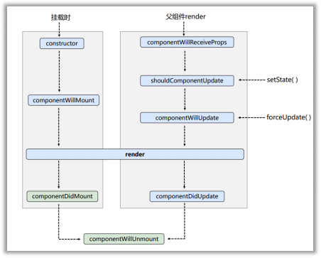
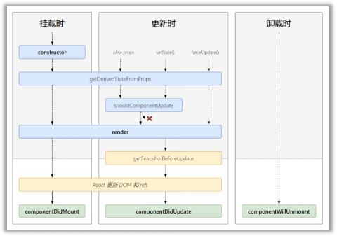

# React全家桶（技术栈）
- [学习地址](https://www.gulixueyuan.com/goods/show/517)
- [示例地址](https://gitee.com/ele-cat/react-basic)

## 1.React入门

### 1.1 React简介

#### 1.1.1 官网
- [英文官网](https://reactjs.org/)
- [中文官网](https://react.docschina.org/)

#### 1.1.2 介绍描述
1. 用于动态构建用户界面的 JavaScript 库(只关注于视图)
2. 由Facebook开源

#### 1.1.3 React的特点
1. 声明式编码
2. 组件化编码
3. React Native 编写原生应用
4. 高效（优秀的Diffing算法）

#### 1.1.4 React高效的原因
1. 使用虚拟(virtual)DOM, 不总是直接操作页面真实DOM。
2. DOM Diffing算法, 最小化页面重绘。

### 1.2 React的基本使用

#### 1.2.1 效果
``` html
<div>
  <h1>Hello,React</h1>
</div>
```

#### 1.2.2 相关js库
1. react.js：React核心库。
2. react-dom.js：提供操作DOM的react扩展库。
3. babel.min.js：解析JSX语法代码转为JS代码的库。

#### 1.2.3 创建虚拟DOM的两种方式
1. 纯JS方式(一般不用)
2. JSX方式

#### 1.2.4 虚拟DOM与真实DOM
1. React提供了一些API来创建一种 “特别” 的一般js对象
    + const VDOM = React.createElement('xx',{id:'xx'},'xx')
    + 上面创建的就是一个简单的虚拟DOM对象
2. 虚拟DOM对象最终都会被React转换为真实的DOM
3. 我们编码时基本只需要操作react的虚拟DOM相关数据, react会转换为真实DOM变化而更新界面。

### 1.3 React JSX

#### 1.3.1 效果
``` html
<div>
  <h1>Hello,jsx</h1>
</div>
```

#### 1.3.2 JSX
1. 全称:  JavaScript XML
2. react定义的一种类似于XML的JS扩展语法: JS + XML本质是React.createElement(component, props, ...children)方法的语法糖
3. 作用: 用来简化创建虚拟DOM 
    + 写法：`var ele = <h1>Hello JSX!</h1>`
    + 注意1：它不是字符串, 也不是HTML/XML标签
    + 注意2：它最终产生的就是一个JS对象
4. 标签名任意: HTML标签或其它标签
5. 标签属性任意: HTML标签属性或其它
6. 基本语法规则
    + 遇到 <开头的代码, 以标签的语法解析: html同名标签转换为html同名元素, 其它标签需要特别解析
    + 遇到以 { 开头的代码，以JS语法解析: 标签中的js表达式必须用{ }包含
7. babel.js的作用
    + 浏览器不能直接解析JSX代码, 需要babel转译为纯JS的代码才能运行
    + 只要用了JSX，都要加上type="text/babel", 声明需要babel来处理

#### 1.3.3 渲染虚拟DOM(元素)
1. 语法:  ReactDOM.render(virtualDOM, containerDOM)
2. 作用: 将虚拟DOM元素渲染到页面中的真实容器DOM中显示
3. 参数说明
    + 参数一: 纯js或jsx创建的虚拟dom对象
    + 参数二: 用来包含虚拟DOM元素的真实dom元素对象(一般是一个div)

#### 1.3.4 JSX练习
- 需求: 动态展示列表
``` html
<!DOCTYPE html>
<html lang="en">
<head>
  <meta charset="UTF-8">
  <meta http-equiv="X-UA-Compatible" content="IE=edge">
  <meta name="viewport" content="width=device-width, initial-scale=1.0">
  <title>hello_react</title>
  <!-- 用于将jsx转化为js -->
  <script src="../js/babel.min.js"></script>
  <!-- 引入react核心库 -->
  <script src="../js/react.development.js"></script>
  <!-- 用于支持dom操作 -->
  <script src="../js/react-dom.development.js"></script>
</head>
<body>
  <!-- 准备容器 -->
  <div id="list"></div>

  <script type="text/babel"> /* 此处一定要写babel */
    // 1.创建虚拟dom
    const VDOM = <ul><li>Vue</li><li>React</li><li>Angular</li></ul>
    // 2.渲染虚拟dom到页面
    ReactDOM.render(VDOM, document.getElementById('list'))
  </script>
</body>
</html>
```

### 1.4 模块与组件、模块化与组件化的理解

#### 1.4.1 模块
1. 理解：向外提供特定功能的js程序, 一般就是一个js文件
2. 为什么要拆成模块：随着业务逻辑增加，代码越来越多且复杂。
3. 作用：复用js, 简化js的编写, 提高js运行效率

#### 1.4.2 组件
1. 理解：用来实现局部功能效果的代码和资源的集合(html/css/js/image等等)
2. 为什么要用组件： 一个界面的功能更复杂
3. 作用：复用编码, 简化项目编码, 提高运行效率

#### 1.4.3 模块化
- 当应用的js都以模块来编写的, 这个应用就是一个模块化的应用

#### 1.4.4 组件化
- 当应用是以多组件的方式实现, 这个应用就是一个组件化的应用

## 2.基本理解和使用

### 2.1 基本理解和使用
#### 2.1.1 使用React开发者工具调试
- 在浏览器中导入`react_dev_tools`插件

#### 2.1.2 效果
函数式组件：
``` js
// 1.创建函数式组件
function MyComponent() {
  console.log(this) // 此处的this是undefined，因为babel编译后开启了严格模式use strict
  return <h2>我是用函数定义的组件（适用于【简单组件】的定义）</h2>
}
// 2.渲染组件到页面
ReactDOM.render(<MyComponent />, document.getElementById('test'))
/*
  执行了渲染函数之后，发生了：
  1.React会解析组件标签，找到MyComponent组件。
  2.发现组件是由函数定义的，随后调用函数，将返回的虚拟DOM转为真实DOM并渲染。
*/
```

类式组件：

``` js
// 1.创建类式组件
class MyComponent extends React.Component {
  render() {
    // render是放在MyComponent的原型上，供实例使用。
    // render中的this，是MyComponents的实例对象
    console.log(this)
    console.log(this instanceof MyComponent)
    return <h2>我是用类定义的组件（适用于【复杂组件】的定义）</h2>
  }
}
// 2.渲染组件到页面
ReactDOM.render(<MyComponent />, document.getElementById('test'))
/*
  执行了渲染函数之后，发生了：
  1.React会解析组件标签，找到MyComponent组件。
  2.发现组件是由类定义的，随后new出来MyComponent类的实例，并通过该实例调用到原型上的render方法。
  3.将render返回的虚拟DOM转化为真实DOM并渲染。
*/
```

#### 2.1.3 注意
1. 组件名必须首字母大写
2. 虚拟DOM元素只能有一个根元素
3. 虚拟DOM元素必须有结束标签

#### 2.1.4 渲染类组件标签的基本流程
1. React内部会创建组件实例对象
2. 调用render()得到虚拟DOM, 并解析为真实DOM
3. 插入到指定的页面元素内部

### 2.2 属性1: state
#### 2.2.1 效果
需求: 定义一个展示天气信息的组件
1. 默认展示天气炎热 或 凉爽
2. 点击文字切换天气

#### 2.2.2 理解
1. state是组件对象最重要的属性, 值是对象(可以包含多个key-value的组合)
2. 组件被称为"状态机", 通过更新组件的state来更新对应的页面显示(重新渲染组件)

#### 2.2.3 强烈注意
1. 组件中render方法中的this为组件实例对象
2. 组件自定义的方法中this为undefined，如何解决？
    + 强制绑定this: 通过函数对象的bind()
    + 箭头函数
3. 状态数据，不能直接修改或更新，需要使用setState函数
4. state的简写方式：
``` js
// 1.创建类式组件
class Weather extends React.Component {
  // 初始化状态
  state = {
    isHot: true,
  }
  render() {
    const {
      isHot,
    } = this.state
    return (
      <div>
        <h2 onClick={this.changeWeather}>今天天气很{isHot ? '炎热' : '凉爽'}</h2>  
      </div>
    )
  }
  // 自定义方法，要用赋值语句+箭头函数的写法
  changeWeather = () => {
    const {isHot} = this.state
    this.setState({
      isHot: !isHot
    })
  }
}

// 2.渲染组件到页面
ReactDOM.render(<Weather />, document.getElementById('test'))
```

### 2.3 属性2: props
#### 2.3.1 效果
需求: 自定义用来显示一个人员信息的组件
1. 姓名必须指定，且为字符串类型；
2. 性别为字符串类型，如果性别没有指定，默认为男
3. 年龄为字符串类型，且为数字类型，默认值为18
``` js
class Person extends React.Component {
  render() {
    const {name, age, gender} = this.props
    return (
      <ul>
        <li>姓名：{name}</li>
        <li>性别：{gender}</li>
        <li>年龄：{age + 1}</li>
      </ul>
    )
  }
}
ReactDOM.render(<Person name="jerry" age={18} gender="男" />, document.getElementById('test1'))
ReactDOM.render(<Person name="tom" age={16} gender="女" />, document.getElementById('test2'))
const p = {name : 'cat', age: 18, gender: '男'}
// console.log('@', ...p)
ReactDOM.render(<Person {...p} />, document.getElementById('test3'))
```

#### 2.3.2 理解
1. 每个组件对象都会有props(properties的简写)属性
2. 组件标签的所有属性都保存在props中
#### 2.3.3 作用
1. 通过标签属性从组件外向组件内传递变化的数据
2. 注意: 组件内部不要修改props数据
#### 2.3.4 编码操作
1. 内部读取某个属性值
``` js
this.props.xxx
```

2. 对props中的属性值进行类型限制和必要性限制
第一种方式（React v15.5 开始已弃用）：
``` js
Person.propTypes = {
  name: React.PropTypes.string.isRequired, // 限制name为必传、字符串
  gender: React.PropTypes.string, // 限制gender为字符串
  age: React.PropTypes.number, // 限制age为数字
}
```
第二种方式（新）：使用prop-types库进限制（需要引入prop-types库）
``` js
Person.propTypes = {
  name: PropTypes.string.isRequired, // 限制name为必传、字符串
  gender: PropTypes.string, // 限制gender为字符串
  age: PropTypes.number, // 限制age为数字
}
```
	
3. 扩展属性: 将对象的所有属性通过props传递
``` js
<Person {...args} />
```

4. 默认属性值：
``` js
Person.defaultProps = {
  gender: '未知', // sex默认值
  age: 18, // age默认值
}
```

5. 组件类的构造函数
``` js
constructor(props) {
  // 构造器是否接收props，是否传递给super取决于是否希望在构造器中，通过this访问props
  super(props)
  // 如果上方不传props，则this.props为undefined
  console.log(this.props)
}
```

6. props的简写方式：
``` js
class Person extends React.Component {
  // 对标签属性进行类型、必要性限制
  static propTypes = {
    name: PropTypes.string.isRequired, // 限制name为必传、字符串
    gender: PropTypes.string, // 限制gender为字符串
    age: PropTypes.number, // 限制age为数字
    speak: PropTypes.func, // 限制speak为函数
  }
  // 置顶标签属性默认值
  static defaultProps = {
    gender: '未知', // sex默认值
    age: 18, // age默认值
    city: '天津',
  }
  constructor(props) {
    // 构造器是否接收props，是否传递给super取决于是否希望在构造器中，通过this访问props
    super(props)
    console.log(this.props)
  }
  render() {
    console.log(this)
    const {name, age, gender} = this.props
    // this.props.name = '123' // props是只读的
    return (
      <ul>
        <li>姓名：{name}</li>
        <li>性别：{gender}</li>
        <li>年龄：{age + 1}</li>
      </ul>
    )
  }
}

ReactDOM.render(<Person name="Jack" age={19} />, document.getElementById('test1'))
```

### 2.4 属性3: refs与事件处理
#### 2.4.1 效果
需求: 自定义组件, 功能说明如下:
  1. 点击按钮, 提示第一个输入框中的值
  2. 当第2个输入框失去焦点时, 提示这个输入框中的值
- 代码如下：
``` js
class Demo extends React.Component {
  render() {
    return (
      <div>
        <input ref="input1" type="text" placeholder="点击按钮提示" />
        <button onClick={this.handleClick} >点击提示左侧数据</button>
        <hr />
        <input ref="input2" type="text" placeholder="失去焦点提示" onBlur={this.handleBlur} />
      </div>
    )
  }
  // 点击按钮提示
  handleClick = () => {
    const {input1} = this.refs
    alert(input1.value)
  }
  // input失去焦点
  handleBlur = () => {
    const {input2} = this.refs
    alert(input2.value)
  }
}
ReactDOM.render(<Demo />, document.getElementById('test1'))
```

#### 2.4.2 理解
- 组件内的标签可以定义ref属性来标识自己
#### 2.4.3 编码
1. 字符串形式的ref【尽量不要使用，会有效率问题】
``` html
<input ref="input1" />
```
2. 回调形式的ref【以内联函数定义时，组件更新会被执行两次】
``` jsx
<input ref={c => this.input1 = c} />
```
3. createRef创建ref容器
``` jsx
myRef = React.createRef()
<input ref={this.myRef} />
```
#### 2.4.4 事件处理
1. 通过onXxx属性指定事件处理函数(注意大小写)
    + React使用的是自定义(合成)事件, 而不是使用的原生DOM事件
    + React中的事件是通过事件委托方式处理的(委托给组件最外层的元素)
2. 通过event.target得到发生事件的DOM元素对象

### 2.5 收集表单数据
#### 2.5.1 效果
需求: 
- 定义一个包含表单的组件
- 输入用户名密码后, 点击登录提示输入信息
#### 2.5.2 理解
包含表单的组件分类：
1. 受控组件
``` js
class Login extends React.Component {
  state = {
    username: '',
    password: '',
  }
  render() {
    return(
      <form onSubmit={this.handleLogin}>
        账号：<input onChange={this.usernameChange} type="text" name="username" /><br />
        密码：<input onChange={this.passwordChange} type="password" name="password" /><br />
        <button>登录</button>
      </form>
    )
  }
  usernameChange = (e) => {
    this.setState({
      username: e.target.value
    })
  }
  passwordChange = (e) => {
    this.setState({
      password: e.target.value
    })
  }
  handleLogin = (e) => {
    e.preventDefault();
    const {username, password} = this.state
    alert(`账号：${username}, 密码：${password}`)
  }
}
ReactDOM.render(<Login />, document.getElementById('test1'))
```
2. 非受控组件
``` js
class Login extends React.Component {
  myInput1 = React.createRef()
  myInput2 = React.createRef()
  render() {
    return(
      <form onSubmit={this.handleLogin}>
        账号：<input ref={c => this.username = c} type="text" name="username" /><br />
        密码：<input ref={c => this.password = c} type="password" name="password" /><br />
        <button>登录</button>
      </form>
    )
  }
  handleLogin = (e) => {
    e.preventDefault();
    const {username, password} = this
    alert(`账号：${username.value}, 密码：${password.value}`)
  }
}
ReactDOM.render(<Login />, document.getElementById('test1'))
```

### 2.6 组件的生命周期
#### 2.6.1 效果
需求:定义组件实现以下功能：
1. 让指定的文本做显示 / 隐藏的渐变动画
2. 从完全可见，到彻底消失，耗时2S
3. 点击按钮从界面中卸载组件
``` js
//创建组件
class Life extends React.Component {
  state = {
    opacity: 1,
  }
  // 组件挂载完毕
  componentDidMount() {
    this.timer = setInterval(() => {
      let {opacity} = this.state
      this.setState({
        opacity: opacity <= 0 ? 1 : opacity - 0.1
      })
    }, 200)
  }
  // 组件将要卸载
  componentWillUnmount() {
    clearInterval(this.timer)
  }
  // 初始化渲染、状态更新之后 1 + n
  render() {
    console.log('render')
    // 挂载
    return(
      <div>
        <h2 style={{opacity: this.state.opacity}}>React学不会怎么办</h2>
        <button onClick={this.BtnClick}>点击</button>
      </div>
    )
  }
  BtnClick = () => {
    // 卸载
    ReactDOM.unmountComponentAtNode(document.getElementById('test'))
  }
}

// 渲染组件
ReactDOM.render(<Life />, document.getElementById('test'))
```

#### 2.6.2 理解
1. 组件从创建到死亡它会经历一些特定的阶段。
2. React组件中包含一系列勾子函数(生命周期回调函数), 会在特定的时刻调用。
3. 我们在定义组件时，会在特定的生命周期回调函数中，做特定的工作。
#### 2.6.3 生命周期流程图(旧)


生命周期的三个阶段（旧）
- **初始化阶段**: 由ReactDOM.render()触发---初次渲染
1. constructor()
2. componentWillMount()
3. render()
4. ***componentDidMount()***
- **更新阶段**: 由组件内部this.setSate()或父组件重新render触发
1. shouldComponentUpdate()
2. componentWillUpdate()
3. render()
4. componentDidUpdate()
- **卸载组件**: 由ReactDOM.unmountComponentAtNode()触发
1. ***componentWillUnmount()***
``` js
//创建组件
class Count extends React.Component {
  // 构造函数
  constructor(props) {
    console.log('Count---constructor')
    super(props)
    this.state = {
      count: 0
    }
  }
  // 组件即将挂载
  componentWillMount() {
    console.log('Count---componentWillMount')
  }
  // 组件挂载完成
  componentDidMount() {
    console.log('Count---componentDidMount')
  }

  // 组件是否应该更新
  shouldComponentUpdate() {
    console.log('Count---shouldComponentUpdate')
    return true
  }
  // 强制组件更新
  forceUpdateByReact = () => {
    this.forceUpdate()
  }
  // 组件即将更新
  componentWillUpdate() {
    console.log('Count---componentWillUpdate')
  }
  // 组件完成更新
  componentDidUpdate() {
    console.log('Count---componentDidUpdate')
  }

  // 组件即将卸载
  componentWillUnmount() {
    console.log('Count---componentWillUnmount')
  }
  // 渲染组件
  render() {
    console.log('Count---render')
    const {count} = this.state
    return(
      <div>
        <h2>当前数字：{count}</h2>	
        <button onClick={this.add}>点击</button><br />
        <button onClick={this.forceUpdateByReact}>强制更新</button><br />
        <button onClick={this.kill}>卸载组件</button>
      </div>
    )
  }
  add = () => {
    let {count} = this.state
    this.setState({
      count: count + 1
    })
  }
  kill = () => {
    ReactDOM.unmountComponentAtNode(document.getElementById('test'))
  }
}

class A extends React.Component {
  state = {
    carName: '奔驰',
  }
  render() {
    return(
      <div>
        <div>我是A组件</div>	
        <button onClick={this.changeCar}>换车</button>
        <B carName={this.state.carName} />
      </div>
    )
  }
  changeCar = () => {
    this.setState({
      carName: '奥拓'
    })
  }
}

class B extends React.Component {
  // 组件即将接收Props
  componentWillReceiveProps(props) {
    console.log('B---componentWillReceiveProps', props)
  }
  // 组件是否应该更新
  shouldComponentUpdate() {
    console.log('B---shouldComponentUpdate')
    return true
  }
  // 组件即将更新
  componentWillUpdate() {
    console.log('B---componentWillUpdate')
  }
  // 组件完成更新
  componentDidUpdate() {
    console.log('B---componentDidUpdate')
  }
  render() {
    console.log('B---render')
    return(
      <div>我是B组件，车名：{this.props.carName}</div>
    )
  }
}

// 渲染组件
ReactDOM.render(<Count />, document.getElementById('test'))
// ReactDOM.render(<A />, document.getElementById('test'))
```

#### 2.6.4 生命周期流程图(新)


生命周期的三个阶段（新）
- **初始化阶段**: 由ReactDOM.render()触发---初次渲染
1. constructor()
2. getDerivedStateFromProps 
3. render()
4. ***componentDidMount()***
- **更新阶段**: 由组件内部this.setSate()或父组件重新render触发
1. getDerivedStateFromProps
2. shouldComponentUpdate()
3. render()
4. getSnapshotBeforeUpdate
5. componentDidUpdate()
- **卸载组件**: 由ReactDOM.unmountComponentAtNode()触发
1. ***componentWillUnmount()***
``` js
//创建组件
class Count extends React.Component {
  // 构造函数
  constructor(props) {
    console.log('Count---constructor')
    super(props)
    this.state = {
      count: 0
    }
  }

  // 通过传入的值获取派生的状态
  static getDerivedStateFromProps(props, state) {
    console.log('Count---getDerivedStateFromProps', props, state)
    return null
  }

  // 在更新之前获取快照
  getSnapshotBeforeUpdate(prevProps, prevState) {
    console.log('getSnapshotBeforeUpdate', prevProps, prevState)
    return 'atCat'
  }

  // 组件挂载完成
  componentDidMount() {
    console.log('Count---componentDidMount')
  }

  // 组件是否应该更新
  shouldComponentUpdate() {
    console.log('Count---shouldComponentUpdate')
    return true
  }
  // 强制组件更新
  forceUpdateByReact = () => {
    this.forceUpdate()
  }
  // 组件完成更新
  componentDidUpdate(prevProps, prevState, snapshotValue) {
    console.log('Count---componentDidUpdate', prevProps, prevState, snapshotValue)
  }

  // 组件即将卸载
  componentWillUnmount() {
    console.log('Count---componentWillUnmount')
  }
  // 渲染组件
  render() {
    console.log('Count---render')
    const {count} = this.state
    return(
      <div>
        <h2>当前数字：{count}</h2>	
        <button onClick={this.add}>点击</button><br />
        <button onClick={this.forceUpdateByReact}>强制更新</button><br />
        <button onClick={this.kill}>卸载组件</button>
      </div>
    )
  }
  add = () => {
    let {count} = this.state
    this.setState({
      count: count + 1
    })
  }
  kill = () => {
    ReactDOM.unmountComponentAtNode(document.getElementById('test'))
  }
}

// 渲染组件
ReactDOM.render(<Count count={199} />, document.getElementById('test'))
```

#### 2.6.5 重要的勾子
1. ***render***：初始化渲染或更新渲染调用
2. ***componentDidMount***：开启监听, 发送ajax请求
3. ***componentWillUnmount***：做一些收尾工作, 如: 清理定时器
#### 2.6.6 即将废弃的勾子
1. componentWillMount
2. componentWillReceiveProps
3. componentWillUpdate
现在使用会出现警告，下一个大版本需要加上UNSAFE_前缀才能使用，以后可能会被彻底废弃，不建议使用。

## 3.React应用(React脚手架)
### 3.1 创建react应用
#### 3.1.1 react脚手架
1. xxx脚手架: 用来帮助程序员快速创建一个基于xxx库的模板项目
    1. 包含了所有需要的配置（语法检查、jsx编译、devServer…）
    2. 下载好了所有相关的依赖
    3. 可以直接运行一个简单效果
2. react提供了一个用于创建react项目的脚手架库: ***create-react-app***
3. 项目的整体技术架构为:  react + webpack + es6 + eslint
4. 使用脚手架开发的项目的特点: 模块化, 组件化, 工程化
#### 3.1.2 创建项目并启动
- 第一步，全局安装：npm i -g create-react-app
- 第二步，切换到想创项目的目录，使用命令：create-react-app hello-react
- 第三步，进入项目文件夹：cd hello-react
- 第四步，启动项目：npm start

#### 3.1.3 react脚手架项目结构
``` ls
public ---- 静态资源文件夹
  favicon.icon ------ 网站页签图标
  index.html -------- 主页面
  logo192.png ------- logo图
  logo512.png ------- logo图
  manifest.json ----- 应用加壳的配置文件
  robots.txt -------- 爬虫协议文件
src ---- 源码文件夹
  App.css -------- App组件的样式
  App.js --------- App组件
  App.test.js ---- 用于给App做测试
  index.css ------ 样式
  index.js ------- 入口文件
  logo.svg ------- logo图
  reportWebVitals.js --- 页面性能分析文件(需要web-vitals库的支持)
  setupTests.js ---- 组件单元测试的文件(需要jest-dom库的支持)
```
#### 3.1.4 功能界面的组件化编码流程（通用）
1. **拆分组件**: 拆分界面，抽取组件
2. **实现静态组件**: 使用组件实现静态页面效果
3. **实现动态组件**:
    - 3.1 动态显示初始化数据
        - 3.1.1 数据类型
        - 3.1.2 数据名称
        - 3.1.2 保存在哪个组件?
    - 3.2 交互(从绑定事件监听开始)

### 3.2 组件的组合使用-TodoList 
功能: 组件化实现此功能
1. 显示所有todo列表
2. 输入文本, 点击按钮显示到列表的首位, 并清除输入的文本

- 父传子props【字符串、布尔值、对象】
- 子传父props【函数】
- uuid【安装：`yarn add nanoid`】【使用：`nanoid()`】
- [TodoList案例](https://gitee.com/ele-cat/react-basic/tree/master/react-staging/03.src_TodoList%E6%A1%88%E4%BE%8B)

## 4.React ajax
### 4.1 理解
#### 4.1.1 前置说明
1. React本身只关注于界面, 并不包含发送ajax请求的代码
2. 前端应用需要通过ajax请求与后台进行交互(json数据)
3. react应用中需要集成第三方ajax库(或自己封装)
#### 4.1.2 常用的ajax请求库
1. jQuery: 比较重, 如果需要另外引入不建议使用
2. axios: 轻量级, 建议使用
    - 封装XmlHttpRequest对象的ajax
    - promise风格
    - 可以用在浏览器端和node服务器端

### 4.2 react脚手架配置代理
#### 方法一
> 在package.json中追加如下配置
``` json
"proxy": "http://localhost:5000"
```
说明：
1. 优点：配置简单，前端请求资源时可以不加任何前缀。
2. 缺点：不能配置多个代理。
3. 工作方式：上述方式配置代理，当请求了3000不存在的资源时，那么该请求会转发给5000 （优先匹配前端资源）
#### 方法二
1. 第一步：创建代理配置文件，在src下创建配置文件：`src/setupProxy.js`
2. 编写setupProxy.js配置具体代理规则：
```js
const proxy = require('http-proxy-middleware')
module.exports = function(app) {
  app.use(
    proxy.createProxyMiddleware('/api1', {  //api1是需要转发的请求(所有带有/api1前缀的请求都会转发给5000)
      target: 'http://localhost:5000', //配置转发目标地址(能返回数据的服务器地址)
      changeOrigin: true, //控制服务器接收到的请求头中host字段的值
      /*
      changeOrigin设置为true时，服务器收到的请求头中的host为：localhost:5000
      changeOrigin设置为false时，服务器收到的请求头中的host为：localhost:3000
      changeOrigin默认值为false，但我们一般将changeOrigin值设为true
      */
      pathRewrite: {'^/api1': ''} //去除请求前缀，保证交给后台服务器的是正常请求地址(必须配置)
    }),
    proxy.createProxyMiddleware('/api2', { 
      target: 'http://localhost:5001',
      changeOrigin: true,
      pathRewrite: {'^/api2': ''}
    })
  )
}
```
- 说明：
1. 优点：可以配置多个代理，可以灵活的控制请求是否走代理。
2. 缺点：配置繁琐，前端请求资源时必须加前缀。
- 注意：
1. 低版本的http-proxy-middleware在配置代理时，不需要加`createProxyMiddleware`，高版本必须加`createProxyMiddleware`
### 4.3 axios
#### 4.3.1 文档
[axios官方文档](http://axios-js.com/)
#### 4.3.2 相关API
1) GET请求
``` js
axios.get('/user?ID=12345')
.then(function (response) {
  console.log(response.data);
})
.catch(function (error) {
  console.log(error);
});

axios.get('/user', {
  params: {
    ID: 12345
  }
})
.then(function (response) {
  console.log(response);
})
.catch(function (error) {
  console.log(error);
});
```
2) POST请求
``` js
axios.post('/user', {
  firstName: 'Fred',
  lastName: 'Flintstone'
})
.then(function (response) {
console.log(response);
})
.catch(function (error) {
console.log(error);
});
```
### 4.4 案例—github用户搜索

- [请求地址](https://api.github.com/search/users?q=xxxxxx)
- [案例地址](https://gitee.com/ele-cat/react-basic/tree/master/react-staging/05.src_axios%E6%A1%88%E4%BE%8Bgithub%E6%90%9C%E7%B4%A2)

### 4.5 消息订阅-发布机制
1. 工具库: [PubSubJS](https://github.com/mroderick/PubSubJS)
2. 下载: npm install pubsub-js --save
3. 使用: 
> - import PubSub from 'pubsub-js' //引入
> - const token = PubSub.subscribe('delete', function(_, data){ }); //订阅
> - PubSub.publish('delete', data) //发布消息
> - PubSub.unsubscribe(token) //移除

- [案例地址](https://gitee.com/ele-cat/react-basic/tree/master/react-staging/06.src_pubsub%E6%A1%88%E4%BE%8Bgithub%E6%90%9C%E7%B4%A2)

### 4.6 扩展：Fetch
#### 4.6.1 文档
1. [官方文档](https://github.github.io/fetch/)
2. [思否文档](https://segmentfault.com/a/1190000003810652)
3. [案例地址](https://gitee.com/ele-cat/react-basic/tree/master/react-staging/07.src_fetch%E6%A1%88%E4%BE%8Bgithub%E6%90%9C%E7%B4%A2)
#### 4.6.2 特点
1. fetch: 原生函数，不再使用XmlHttpRequest对象提交ajax请求
2. 老版本浏览器可能不支持

#### 4.6.3 相关API
1. GET请求
``` js
fetch(url).then(function(response) {
  return response.json()
}).then(function(data) {
  console.log(data)
}).catch(function(e) {
  console.log(e)
});
```
2. POST请求
``` js
fetch(url, {
  method: "POST",
  body: JSON.stringify(data),
}).then(function(data) {
  console.log(data)
}).catch(function(e) {
  console.log(e)
})
```
## 5.React路由
### 5.1 相关理解
#### 5.1.1 SPA的理解
1. 单页Web应用（single page web application，SPA）。
2. 整个应用只有一个完整的页面。
3. 点击页面中的链接不会刷新页面，只会做页面的局部更新。
4. 数据都需要通过ajax请求获取, 并在前端异步展现。
#### 5.1.2 路由的理解
1. 什么是路由?
    1. 一个路由就是一个映射关系(key:value)
    2. key为路径, value可能是function或component
2. 路由分类
    1. 后端路由：
        - 理解： value是function, 用来处理客户端提交的请求。
        - 注册路由： router.get(path, function(req, res))
        - 工作过程：当node接收到一个请求时, 根据请求路径找到匹配的路由, 调用路由中的函数来处理请求, 返回响应数据
    2. 前端路由：
        - 浏览器端路由，value是component，用于展示页面内容。
        - 注册路由: `<Route path="/test" component={Test}>`
        - 工作过程：当浏览器的path变为/test时, 当前路由组件就会变为Test组件

#### 5.1.3 react-router-dom的理解
1. react的一个插件库。
2. 专门用来实现一个SPA应用。
3. 基于react的项目基本都会用到此库。

### 5.2 react-router-dom相关API
#### 5.2.1 内置组件
1. `<BrowserRouter>` history模式的包裹
2. `<HashRouter>`    hash模式的包裹
3. `<Route>`         注册路由组件
4. `<Redirect>`      重定向组件
5. `<Link>`          跳转组件
6. `<NavLink>`       跳转组件-高亮匹配
7. `<Switch>`        路由匹配到即停止
#### 5.2.2 其它
1. history对象
2. match对象
3. withRouter函数

### 5.3 路由的使用

#### 5.3.1 路由的基本使用
1. 明确好界面中的组件构造
2. 导航区的a标签改为`<Link to=""></Link>`标签
3. 内容区的展示组件改为`<Route path="" component={} />`标签
4. 在`<App />`标签外包裹`<BrowserRouter>`或`<HashRouter>`
- [案例地址](https://gitee.com/ele-cat/react-basic/tree/master/react-staging/08.src_%E8%B7%AF%E7%94%B1%E7%9A%84%E5%9F%BA%E6%9C%AC%E4%BD%BF%E7%94%A8)

#### 5.3.2 路由组件与一般组件的差异
1. 写法不同：
    - 一般组件`<Demo />`
    - 路由组件`<Route path="/demo" component={Demo} />`
2. 存放位置不同：
    - 一般组件：component
    - 路由组件：pages
3. 接收到的props不同
    - 一般组件：父组件传递进来的数据
    - 路由组件：接收路由传递的属性
    ``` js
        history:
          go: ƒ go(n)
          goBack: ƒ goBack()
          goForward: ƒ goForward()
          push: ƒ push(path, state)
          replace: ƒ replace(path, state)
        location:
          pathname: "/about"
          search: ""
          state: undefined
        match:
          isExact: true
          params: {}
          path: "/about"
          url: "/about"
    ```
#### 5.3.3 NavLink的使用

> 使用场景：当需要给路由添加高亮时
``` html
就可以把
<Link to="/about">About</Link>
替换为：
<NavLink to="/about">About</NavLink>
```
1. 当切换到对应的路由时，会给对应的a标签添加`active`类
2. 可通过修改`activeClassName`，来修改高亮`className`
3. 示例：
``` html
<NavLink activeClassName='ecat' className="list-group-item" to="/about">About</NavLink>
简写：
<NavLink activeClassName='ecat' className="list-group-item" to="/about" children="About" />
```
4. [案例地址](https://gitee.com/ele-cat/react-basic/tree/master/react-staging/09.src_NavLink%E7%9A%84%E4%BD%BF%E7%94%A8)
> 可通过`this.props.children`来获取组件标签体内容
- [封装NavLink案例地址](https://gitee.com/ele-cat/react-basic/tree/master/react-staging/10.src_NavLink%E5%B0%81%E8%A3%85)

#### 5.3.4 Switch使用
1. 通常情况下，`Route`的 path 和 component 是一一对应的关系。
2. `Switch`可以提高路由的匹配效率【匹配到即停止】。
``` html
<Switch>
  <Route path="/home" component={Home} />
  <Route path="/home" component={Test} />
  <Route path="/about" component={About} />
</Switch>
```
- [案例地址](https://gitee.com/ele-cat/react-basic/tree/master/react-staging/11.Switch%E7%9A%84%E4%BD%BF%E7%94%A8)

#### 5.3.5 样式缺失修复
1. public目录下的`index.html`中引用文件使用绝对路径
``` html
<link rel="stylesheet" href="/css/bootstrap.css">
```
2. public目录下的`index.html`中引用文件使用`%PUBLIC_URL%`
``` html
<link rel="stylesheet" href="%PUBLIC_URL%/css/bootstrap.css">
```
3. 根`<App />`组件使用`<HashRouter>`包裹
``` jsx
<HashRouter>
  <App />
</HashRouter>
```
- [案例地址](https://gitee.com/ele-cat/react-basic/tree/master/react-staging/12.src_%E6%A0%B7%E5%BC%8F%E7%BC%BA%E5%A4%B1%E4%BF%AE%E5%A4%8D)

#### 5.3.6 路由的严格匹配和模糊匹配
1. 默认使用的是模糊匹配，【输入的路径】必须要包含【匹配的路径】，且**顺序一致**
2. 开启严格模式`<Route exact path="" component={} />`
3. 严格模式不要随意开启，需要再打开，否则会导致无法匹配二级路由
- [案例地址](https://gitee.com/ele-cat/react-basic/tree/master/react-staging/13.src_%E7%B2%BE%E5%87%86%E5%8C%B9%E9%85%8D%E4%B8%8E%E6%A8%A1%E7%B3%8A%E5%8C%B9%E9%85%8D)

#### 5.3.7 Redirect使用
1. 一般写在所有路由注册的最下方，当所有路由都无法匹配时，跳转到Redirect指定的路由
2. 示例：
``` jsx
<Switch>
  <Route path="/home" component={Home} />
  <Route path="/about" component={About} />
  <Redirect to="/home" />
</Switch>
```
- [案例地址](https://gitee.com/ele-cat/react-basic/tree/master/react-staging/14.src_Redirect%E4%BD%BF%E7%94%A8)

#### 5.3.8 嵌套路由
1. 注册子路由时要写上父路由的path值
2. 路由的匹配是按照路由注册的顺序进行的
- [案例地址](https://gitee.com/ele-cat/react-basic/tree/master/react-staging/15.src_%E5%B5%8C%E5%A5%97%E8%B7%AF%E7%94%B1)

### 5.4 路由传参
#### 5.4.1 params传参
1. 路由链接（携带参数）
``` jsx
<Link to=`/home/news/detail/${id}`>新闻1</Link>
```
2. 注册路由（接收参数）
``` jsx
<Route path="/home/news/detail/:id" component={Detail} />
```
3. 组件接参
``` jsx
const {id} = this.props.match.params
```
- [案例地址](https://gitee.com/ele-cat/react-basic/tree/master/react-staging/16.src_%E4%BC%A0%E5%8F%82params)

#### 5.4.2 search参数
1. 路由链接（携带参数）
``` jsx
<Link to=`/home/news/detail/?id=${id}`>新闻1</Link>
```
2. 注册路由（无需接收参数）
``` jsx
<Route path="/home/news/detail" component={Detail} />
```
3. 组件接参
``` jsx
import qs from 'querystringify'
// 获取到的search是一个urlencoded编码字符串，需要解析
const {id} = qs.parse(this.props.location.search)
```
- [案例地址](https://gitee.com/ele-cat/react-basic/tree/master/react-staging/17.src_%E4%BC%A0%E5%8F%82search)

#### 5.4.3 state参数
1. 路由链接（携带参数）
``` jsx
<Link to={{pathname: '/home/news/detail', state: {id: item.id}}}>新闻1</Link>
```
2. 注册路由（无需接收参数）
``` jsx
<Route path="/home/news/detail" component={Detail} />
```
3. 组件接参
``` jsx
const {id} = this.props.location.state
```
- [案例地址](https://gitee.com/ele-cat/react-basic/tree/master/react-staging/18.src_%E4%BC%A0%E5%8F%82state)

### 5.5 路由跳转模式
1. push
``` jsx
<Link to={{pathname: '/home/news/detail', state: {id: item.id}}}>新闻1</Link>
```
2. replace
``` jsx
<Link replace to={{pathname: '/home/news/detail', state: {id: item.id}}}>新闻1</Link>
```
- [案例地址](https://gitee.com/ele-cat/react-basic/tree/master/react-staging/19.src_push&replace)

### 5.6 编程式路由
> 借助`this.props.history`对象上的API对路由进行跳转、前进、后退操作
``` jsx
this.props.history.push()      // 跳转
this.props.history.replace()   // 替换
this.props.history.goBack()    // 后退
this.props.history.goForward() // 前进
this.props.history.go()        // 前进||后退
```
- [案例地址](https://gitee.com/ele-cat/react-basic/tree/master/react-staging/20.src_%E7%BC%96%E7%A8%8B%E5%BC%8F%E8%B7%AF%E7%94%B1)

### 5.7 withRouter
> 一般组件的`props`中没有路由组件所持有的history API
- 需要使用`withRouter`
- withRouter可以加工一般组件，让一般组件可以具备路由组件所特有的API
- withRouter返回的是一个新组件
- 示例：
``` jsx
import React, { Component } from 'react'
import {withRouter} from 'react-router-dom'

class Header extends Component {
  forward = () => {
    this.props.history.goForward()
  }
  back = () => {
    this.props.history.goBack()
  }
  go = () => {
    this.props.history.go(-1)
  }
  render() {
    console.log('一般组件收到的props', this.props)
    return (
      <div className="page-header">
        <h2>React Router Demo</h2>
        <button onClick={this.forward}>前进</button>
        <button onClick={this.back}>后退</button>
        <button onClick={this.go}>go</button>
      </div>
    )
  }
}

export default withRouter(Header)
```
- [案例地址](https://gitee.com/ele-cat/react-basic/tree/master/react-staging/21.src_withRouter)

### 5.8 BrowserRouter与HashRouter的区别
1. 底层原理不一样：
    1. BrowserRouter使用的是H5的history API，不兼容IE9及以下版本。
    2. HashRouter使用的是URL的哈希值。
2. path表现形式不一样
    1. BrowserRouter的路径中没有#,例如：localhost:3000/demo/test
    2. HashRouter的路径包含#,例如：localhost:3000/#/demo/test
3. 刷新后对路由state参数的影响
    1. BrowserRouter没有任何影响，因为state保存在history对象中。
    2. HashRouter刷新后会导致路由state参数的丢失！！！
4. 备注：HashRouter可以用于解决一些路径错误相关的问题。

## 6.开源React UI组件库
### 6.1.1 material-ui(国外)
1. [官网地址](http://www.material-ui.com/#/)
2. [github地址](https://github.com/callemall/material-ui)
### 6.1.2 ant-design(国内蚂蚁金服)
1. [官网地址](https://ant-design.gitee.io/index-cn)
2. [github地址](https://github.com/ant-design/ant-design/)
3. 安装依赖
``` sh
yarn add antd
# or
npm install antd --save
```
4. 使用
``` jsx
import React from 'react';
import { DatePicker } from 'antd';

const App = () => {
  return <DatePicker />;
};

export default App;
```
5. 配置默认主题
``` jsx
import React from 'react'
import ReactDOM from 'react-dom/client'
import { ConfigProvider } from 'antd';
import App from './App'

const root = ReactDOM.createRoot(document.getElementById('root'))

root.render(
  <ConfigProvider
    theme={{
      token: {
        colorPrimary: '#00b96b',
      },
      components: {
        Button: {
          colorPrimary: '#0ff',
        },
      },
    }}
  >
    <App />
  </ConfigProvider>
)
```