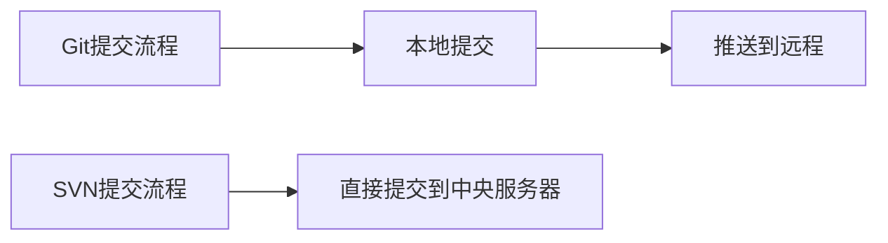

# Git 面试题

## 1、Git是什么

Git 是一个**分布式版本控制系统**，主要用于跟踪和管理软件开发过程中的代码变更。以下是 Git 的核心要点：

### 核心特点

1. **版本控制**：记录文件的所有历史修改，可回溯到任意版本
2. **分布式架构**：每个开发者都有完整的代码仓库副本
3. **高效协作**：支持多人并行开发，轻松合并代码变更
4. **分支管理**：轻量级分支使功能开发和实验更安全

### 基本功能

- 记录代码的每次修改（谁、何时、改了什么）
- 支持创建多个开发分支并行工作
- 可回退到任意历史版本
- 提供代码合并和冲突解决工具
- 与GitHub/GitLab等平台集成实现团队协作

### 典型工作流程

1. 初始化仓库：`git init`
2. 添加文件到暂存区：`git add .`
3. 提交变更：`git commit -m "描述"`
4. 创建分支：`git branch develop`
5. 合并分支：`git merge`
6. 同步远程仓库：`git push/pull`

Git 已成为现代软件开发的标准工具，适用于从个人项目到大型企业级应用的所有规模项目。

## 2、简述Git中如何将一个新增文件添加到本地仓库

```bash
# 1. 创建新文件
echo "Hello Git" > greeting.txt

# 2. 检查文件状态
git status  # 输出会显示 `Untracked files` 部分列出新文件

# 3. 添加到暂存区
git add greeting.txt # 添加单个文件
# 或
git add.  # 添加所有新文件和修改过的文件

# 4. 确认已暂存
git status  # 此时文件会出现在 "Changes to be committed" 下

# 5. 提交到仓库
git commit -m "Add greeting file with initial content"  # 提交更改并添加描述

# 6. 验证提交
git log -1  # 查看最新提交记录
```

## 3、Git常用命令

### 1、基础配置命令

1. **设置用户信息**
   ```bash
   git config --global user.name "Your Name"
   git config --global user.email "your.email@example.com"
   ```

2. **查看配置**
   ```bash
   git config --list
   ```

### 2、仓库操作命令

1. **初始化仓库**
   ```bash
   git init
   ```

2. **克隆远程仓库**
   ```bash
   git clone https://github.com/user/repo.git
   ```

3. **克隆指定分支**
   ```bash
   git clone -b branch_name https://github.com/user/repo.git
   ```

### 3、文件操作命令

1. **查看文件状态**
   ```bash
   git status
   ```

2. **添加文件到暂存区**
   ```bash
   git add file.txt          # 添加单个文件
   git add .                 # 添加所有修改和新文件
   git add -u                # 添加所有修改（不包括新文件）
   ```

3. **提交更改**
   ```bash
   git commit -m "提交信息"
   ```

4. **添加并提交**
   ```bash
   git commit -am "提交信息"  # 仅对已跟踪文件有效
   ```

### 4、分支操作命令

1. **查看分支**
   ```bash
   git branch               # 查看本地分支
   git branch -a            # 查看所有分支（包括远程）
   ```

2. **创建分支**
   ```bash
   git branch branch_name
   ```

3. **切换分支**
   ```bash
   git checkout branch_name
   git switch branch_name   # Git 2.23+ 推荐方式
   ```

4. **创建并切换分支**
   ```bash
   git checkout -b branch_name
   git switch -c branch_name
   ```

5. **合并分支**
   ```bash
   git merge branch_name
   ```

6. **删除分支**
   ```bash
   git branch -d branch_name     # 安全删除
   git branch -D branch_name     # 强制删除
   ```

### 5、远程仓库操作

1. **添加远程仓库**
   ```bash
   git remote add origin https://github.com/user/repo.git
   ```

2. **查看远程仓库**
   ```bash
   git remote -v
   ```

3. **推送分支**
   ```bash
   git push origin branch_name
   ```

4. **拉取更新**
   ```bash
   git pull origin branch_name
   ```

5. **获取远程更新**
   ```bash
   git fetch origin
   ```

### 6、撤销与回退

1. **撤销工作区修改**
   ```bash
   git checkout -- file.txt
   ```

2. **撤销暂存区修改**
   ```bash
   git reset HEAD file.txt
   ```

3. **回退到指定提交**
   ```bash
   git reset --hard commit_id
   ```

4. **修改最后一次提交**
   ```bash
   git commit --amend
   ```

### 7、日志与比较

1. **查看提交历史**
   ```bash
   git log
   git log --oneline        # 简洁显示
   git log --graph          # 图形化显示
   ```

2. **查看文件修改**
   ```bash
   git diff
   git diff --cached        # 查看暂存区修改
   ```

3. **查看某行代码历史**
   ```bash
   git blame file.txt
   ```

### 8、标签管理

1. **创建标签**
   ```bash
   git tag v1.0.0
   ```

2. **查看标签**
   ```bash
   git tag
   ```

3. **推送标签**
   ```bash
   git push origin v1.0.0
   git push origin --tags    # 推送所有标签
   ```

### 9、高级操作

1. **储藏修改**
   ```bash
   git stash                # 储藏当前修改
   git stash list           # 查看储藏列表
   git stash apply          # 恢复最近储藏
   ```

2. **交互式暂存**
   ```bash
   git add -p
   ```

3. **重写提交历史**
   ```bash
   git rebase -i HEAD~3     # 交互式变基最近3次提交
   ```

### 10、实用技巧

1. **忽略文件**
   ```bash
   # 编辑 .gitignore 文件
   echo "node_modules/" >> .gitignore
   ```

2. **查看仓库大小**
   ```bash
   git count-objects -vH
   ```

3. **清理无效文件**
   ```bash
   git gc
   ```

4. **子模块管理**
   ```bash
   git submodule add https://github.com/user/repo.git path/to/submodule
   ```

掌握这些常用 Git 命令可以应对日常开发中的大部分版本控制需求。建议根据实际工作流程灵活组合使用这些命令。

## 4、Git和SVN有什么区别

### 1、架构设计差异

| 特性         | Git (分布式)                          | SVN (集中式)                         |
|--------------|--------------------------------------|--------------------------------------|
| **仓库类型**  | 每个开发者都有完整的本地仓库           | 只有一个中央仓库                      |
| **工作模式**  | 本地提交，后同步到远程                 | 直接提交到中央服务器                   |
| **网络需求**  | 可以离线工作（除同步操作）             | 大多数操作需要网络连接                 |

### 2、核心功能对比

#### 1. 版本控制方式
- **Git**：基于内容寻址的文件系统，使用SHA-1哈希值标识对象
- **SVN**：基于文件差异的版本控制，使用递增的版本号

#### 2. 分支与合并
| 特性         | Git                                  | SVN                                  |
|--------------|--------------------------------------|--------------------------------------|
| **分支创建**  | 极快（仅创建指针）                   | 较慢（需复制目录）                   |
| **分支成本**  | 几乎零成本                          | 高成本（影响服务器性能）              |
| **合并体验**  | 优秀（自动识别历史）                 | 较差（容易冲突）                     |

#### 3. 提交过程


### 3、性能比较

1. **常见操作速度**：
   - `git status`：毫秒级（仅检查本地）
   - `svn status`：秒级（需要与服务器通信）

2. **存储效率**：
   - Git使用压缩对象存储，相同项目.git目录通常比SVN的.svn小

3. **大文件处理**：
   - Git-LFS需要额外配置
   - SVN原生支持大文件版本控制

### 4、适用场景

#### 推荐使用 Git 的情况
- 需要频繁分支/合并的开发流程（如Git Flow）
- 分布式团队或经常离线工作
- 开源项目协作开发
- 需要精细的本地版本控制

#### 推荐使用 SVN 的情况
- 需要严格的目录级权限控制
- 二进制文件较多的项目（如游戏美术资源）
- 传统企业级开发环境
- 需要简单的线性版本管理

### 5、典型工作流对比

#### Git 工作流示例
```bash
# 本地开发
git checkout -b feature/new-module
git commit -am "实现新功能"
git push origin feature/new-module

# 创建Pull Request进行代码审查
```

#### SVN 工作流示例
```bash
# 直接提交到中央仓库
svn update
svn add newfile.txt
svn commit -m "添加新文件"
```

### 6、安全与权限

| 特性         | Git                                  | SVN                                  |
|--------------|--------------------------------------|--------------------------------------|
| **访问控制**  | 仓库级（需第三方工具细化）           | 目录级精细控制                       |
| **审计能力**  | 需要额外工具                         | 原生支持完善审计                     |
| **数据安全**  | 每个副本都是完整备份                 | 依赖中央服务器备份                   |

### 7、面试回答要点

1. **架构差异**：强调分布式vs集中式的根本区别
2. **分支优势**：重点说明Git的分支模型优势
3. **离线能力**：Git支持完整的离线开发
4. **适用场景**：根据项目需求选择合适工具
5. **迁移成本**：提及从SVN迁移到Git的常见方案

示例回答：
"Git是分布式版本控制系统，每个开发者都有完整仓库历史，支持强大的分支功能和离线工作；SVN是集中式系统，依赖中央服务器但提供更严格的权限控制。Git的分支创建和合并效率远高于SVN，适合需要频繁分支的敏捷开发，而SVN在目录级权限管理和二进制文件处理上更有优势。现代软件开发中Git已成为主流，但SVN在特定企业环境中仍有应用。"